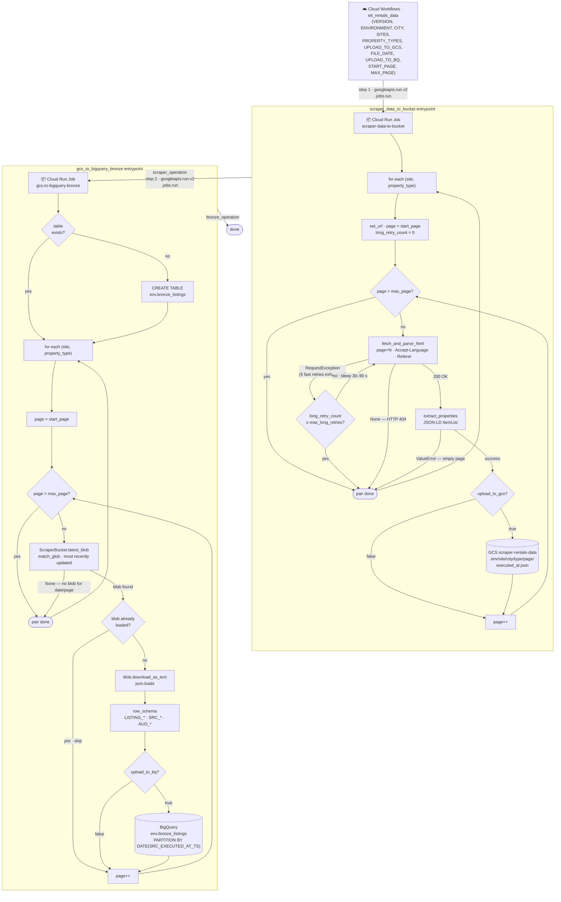

# Rentals Data Pipeline


## *Motivation*

Brazilian rental-market prices move fast and aren't trivially comparable across listing sites — each platform has its own search URLs, page layouts, and JSON-LD shapes, and none of them expose a public feed for tracking how asking prices for apartments and houses in a given city evolve over time. To answer questions like *"how is rent in Macaé trending vs. last quarter?"* we need to capture that history ourselves, listing by listing, day by day.

## *Main Goal*

Land an append-only history of rental listings for every configured `(site, city, property_type)` tuple in a single GCS bucket, partitioned in a layout that downstream warehouse models (dbt-bigquery is on the dependency list for this) can consume directly without further cleanup.

---

## Project

### *Solution*

For each configured combination of listing site, city, and property type, the pipeline automatically collects all available rental listings across all pages and stores a per-page timestamped snapshot in cloud storage. Data is partitioned by environment, site, city, property type, and page so that downstream models can consume it directly without further cleanup.

Collection runs automatically on Google Cloud through a managed workflow layer. Each pipeline step is containerised and executed on demand, with configuration centrally managed in `cloud/` — one YAML file per task defining how it runs, and one YAML file per workflow defining the execution order. Adding a new listing site or city requires only a small configuration change with no infrastructure work.

### *Code Structure*

```txt
├── .claude/                    # Claude Code files;
├── .code_quality/              # Config files to ensure clean code;
├── .github/                    # GitHub automations;
├── .vscode/                    # VSCode configurations for development;
├── cloud/                      # Cloud execution configuration;
│   ├── settings.yml            # Single source of truth for GCP project config (project_id, region);
│   ├── tasks/                  # One YAML per task — operator type, machine config, parameters;
│   └── workflows/              # One YAML per workflow — Cloud Workflows native execution graph;
├── docs/                       # Documentation files;
├── notebooks/                  # Jupyter notebooks for exploration and prototyping;
├── scripts/                    # Operational scripts (setup, Docker entrypoint, deploy);
├── src/                        # Source code;
│   └── app/                    # Main application code;
├── terraform/                  # GCP infrastructure managed by Terraform;
├── tests/                      # Pytests for quality assurance;
├── .dockerignore               # Files excluded from the Docker build context;
├── .gitattributes              # Define attributes for pathnames;
├── .gitignore                  # Files that Git should ignore when committing;
├── AUTHORS.md                  # List of individuals who contributed to the project;
├── CHANGELOG.md                # Annotate notable changes for each version;
├── CLAUDE.md                   # Instructions, standards and context to Claude Code AI agent;
├── CODING_GUIDELINES.md        # Standards and best practices for the codebase;
├── Dockerfile                  # Container definition, one image per task;
├── poetry.lock                 # Ensure reproducible builds across envs;
├── pyproject.toml              # Centralized configurations for Python project;
└── README.md                   # YOU ARE HERE!
```

### *Workflow · etl_rentals_data*



### *Documentations*

Follow our [CODING_GUIDELINES.md](CODING_GUIDELINES.md) to check our way of code.

## License and Authors

This project is maintained by the **Dark Theme Org**.
