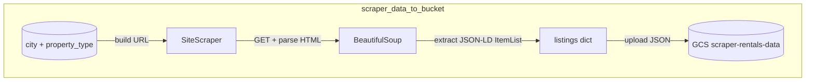

# Rentals Data Pipeline


## *Motivation*

Brazilian rental-market prices move fast and aren't trivially comparable across listing sites — each platform has its own search URLs, page layouts, and JSON-LD shapes, and none of them expose a public feed for tracking how asking prices for apartments and houses in a given city evolve over time. To answer questions like *"how is rent in Macaé trending vs. last quarter?"* we need to capture that history ourselves, listing by listing, day by day.

## *Main Goal*

Land an append-only history of rental listings for every configured `(site, city, property_type)` tuple in a single GCS bucket, partitioned in a layout that downstream warehouse models (dbt-bigquery is on the dependency list for this) can consume directly without further cleanup.

---

## Project

### *Solution*

A Python entrypoint (`app.entrypoints.scraper_data_to_bucket`) orchestrates one `SiteScraper` subclass per supported site (`VivaRealScraper`, `ZapImoveisScraper`). Each scraper builds its site-specific URL from the `(city, property_type)` pair, fetches the HTML with retries + exponential backoff (tenacity), parses it (BeautifulSoup), and extracts the embedded `ItemList` JSON-LD block as a `{listing @id → payload}` dict. The entrypoint then uploads that payload as a single timestamped JSON blob to `gs://scraper-rentals-data/<env>/<site>/<city>/<property_type>/<executed_at>.json`. The bucket itself and the runtime service account are managed by Terraform under [terraform/](terraform/README.md). Adding a new listing site is a ~10-line subclass; adding a new city is a one-line addition to `CITIES_UF` in `app/data/scrapers/settings.py`.

### *Code Structure*

```txt
├── .claude/                    # Claude Code files;
├── .code_quality/              # Config files to ensure clean code;
├── .github/                    # GitHub automations;
├── .vscode/                    # VSCode configurations for development;
├── commands/                   # Shell commands;
├── docs/                       # Documentation files;
├── notebooks/                  # Jupyter notebooks for exploration and prototyping;
├── src/                        # Source code;
│   └── app/                    # Main application code;
├── tests/                      # Pytests for quality assurance;
├── .gitattributes              # Define attributes for pathnames;
├── .gitignore                  # Files that Git should ignore when committing;
├── AUTHORS.md                  # List of individuals who contributed to the project;
├── CHANGELOG.md                # Annotate notable changes for each version;
├── CLAUDE.md                   # Instructions, standards and context to Claude Code AI agent;
├── CODING_GUIDELINES.md        # Standards and best practices for the codebase;
├── poetry.lock                 # Ensure reproducible builds across envs;
├── pyproject.toml              # Centralized configurations for Python project;
├── README.md                   # YOU ARE HERE!
```

### *Workflow*

#### *1. scraper_data_to_bucket*



### *Documentations*

Follow our [CODING_GUIDELINES.md](CODING_GUIDELINES.md) to check our way of code.

## License and Authors

This project is maintained by the **Dark Theme Org**.
