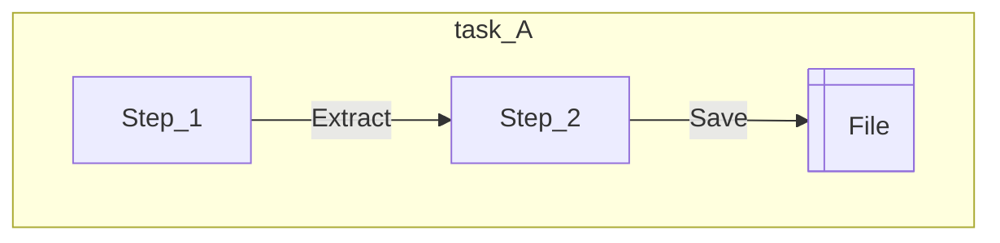

# Rentals Data Pipeline


## *Motivation*

...

## *Main Goal*

...

---

## Project

### *Solution*

...

### *Code Structure*

```txt
├── .claude/                    # Claude Code files;
├── .code_quality/              # Config files to ensure clean code;
├── .github/                    # GitHub automations;
├── .vscode/                    # VSCode configurations for development;
├── commands/                   # Shell commands;
├── docs/                       # Documentation files;
├── notebooks/                  # Jupyter notebooks for exploration and prototyping;
├── src/                        # Source code;
│   └── app/                    # Main application code;
├── tests/                      # Pytests for quality assurance;
├── .gitattributes              # Define attributes for pathnames;
├── .gitignore                  # Files that Git should ignore when committing;
├── AUTHORS.md                  # List of individuals who contributed to the project;
├── CHANGELOG.md                # Annotate notable changes for each version;
├── CLAUDE.md                   # Instructions, standards and context to Claude Code AI agent;
├── CODING_GUIDELINES.md        # Standards and best practices for the codebase;
├── poetry.lock                 # Ensure reproducible builds across envs;
├── pyproject.toml              # Centralized configurations for Python project;
├── README.md                   # YOU ARE HERE!
```

### *Workflow*

#### *1. Task A (Example)*



### *Documentations*

Follow our [CODING_GUIDELINES.md](CODING_GUIDELINES.md) to check our way of code.

## License and Authors

This project is maintained by the **Dark Theme Org**.
